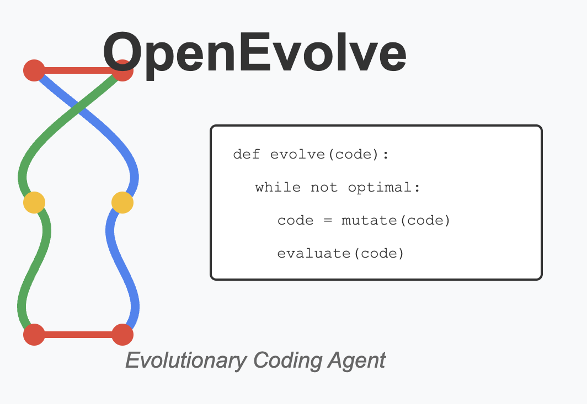
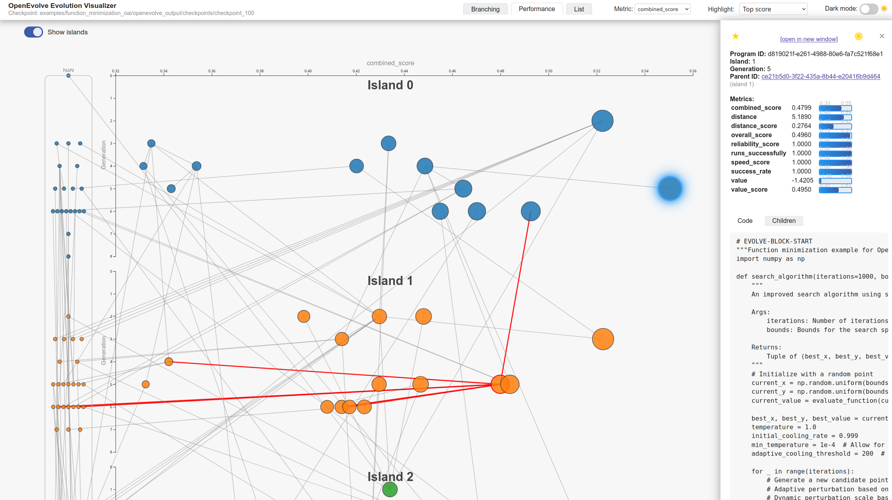

# OpenEvolve

<div align="center">



**🧬 最先进的开源进化代码智能体**

*将您的LLM转化为自主代码优化器，发现突破性算法*

<p align="center">
  <a href="https://github.com/codelion/openevolve/stargazers"></a>
  <a href="https://pypi.org/project/openevolve/"></a>
  <a href="https://pypi.org/project/openevolve/"></a>
  <a href="https://github.com/codelion/openevolve/blob/main/LICENSE"></a>
</p>

[🚀 **快速开始**](#-快速开始) • [📖 **示例**](#-示例展示) • [💬 **讨论**](https://github.com/codelion/openevolve/discussions)

*从随机搜索到最先进水平：实时观看您的代码进化*

</div>

---

## ✨ 为什么选择OpenEvolve？

<table>
<tr>
<td width="33%">

### 🎯 **自主发现**
LLM不仅仅是优化——而是**发现**全新的算法。无需人工指导。

</td>
<td width="33%">

### ⚡ **经过验证的结果**
在实际硬件上实现**2-3倍加速**。圆填充问题达到**最先进水平**。**突破性**优化。

</td>
<td width="33%">

### 🔬 **研究级品质**
内置完全可重现性、广泛评估流程和科学严谨性。

</td>
</tr>
</table>

**OpenEvolve vs 手动优化：**

| 方面 | 手动优化 | OpenEvolve |
|--------|-------------------|------------|
| **解决时间** | 数天到数周 | 数小时 |
| **探索广度** | 受人类创造力限制 | 无限的LLM创造力 |
| **可重现性** | 难以复制 | 完全确定 |
| **多目标** | 复杂的权衡 | 自动帕累托优化 |
| **扩展性** | 无法扩展 | 跨岛屿的并行进化 |

## 🏆 已验证的成就

<div align="center">

| 🎯 **领域** | 📈 **成就** | 🔗 **示例** |
|---------------|-------------------|----------------|
| **GPU优化** | Apple Silicon上2-3倍加速 | [MLX Metal内核](examples/mlx_metal_kernel_opt/) |
| **数学问题** | 圆填充问题达到最先进水平（n=26） | [圆填充](examples/circle_packing/) |
| **算法设计** | 自适应排序算法 | [Rust自适应排序](examples/rust_adaptive_sort/) |
| **科学计算** | 自动化滤波器设计 | [信号处理](examples/signal_processing/) |
| **多语言** | Python、Rust、R、Metal着色器 | [所有示例](examples/) |

</div>

## 🚀 快速开始

**30秒内从零开始进化代码：**

```bash
# 安装OpenEvolve
pip install openevolve

# 设置LLM API密钥（支持任何OpenAI兼容的提供商）
export OPENAI_API_KEY="your-api-key"

# 运行您的第一次进化！
python -c "
from openevolve import run_evolution
result = run_evolution(
    'examples/function_minimization/initial_program.py',
    'examples/function_minimization/evaluator.py'
)
print(f'最佳分数: {result.best_score:.4f}')
"
```

**需要更多控制？** 使用完整的CLI：

```bash
python openevolve-run.py examples/function_minimization/initial_program.py \
  examples/function_minimization/evaluator.py \
  --config examples/function_minimization/config.yaml \
  --iterations 1000
```

**更喜欢Docker？**
```bash
docker run --rm -v $(pwd):/app ghcr.io/codelion/openevolve:latest \
  examples/function_minimization/initial_program.py \
  examples/function_minimization/evaluator.py --iterations 100
```

## 🎬 实际应用展示

<details>
<summary><b>🔥 圆填充：从随机到最先进水平</b></summary>

**实时观看OpenEvolve发现最优圆填充：**

| 第1代 | 第190代 | 第460代（最终） |
|--------------|----------------|----------------------|
|  |  |  |
| 随机放置 | 学习结构 | **最先进水平结果** |

**结果**：与已发表的n=26圆填充问题基准相匹配。

</details>

<details>
<summary><b>⚡ GPU内核进化</b></summary>

**进化前（基线）**：
```metal
// 标准注意力实现
kernel void attention_baseline(/* ... */) {
    // 通用矩阵乘法
    float sum = 0.0;
    for (int i = 0; i < seq_len; i++) {
        sum += query[tid] * key[i];
    }
}
```

**进化后（2.8倍加速）**：
```metal
// OpenEvolve发现的优化
kernel void attention_evolved(/* ... */) {
    // 硬件感知分块 + 统一内存优化
    threadgroup float shared_mem[256];
    // ... 进化的算法利用Apple Silicon架构
}
```

**性能影响**：在Apple M1 Pro上实现2.8倍加速，保持数值精度。

</details>

## 🧬 OpenEvolve如何工作

OpenEvolve实现了复杂的**进化代码流程**，远超简单优化：


### 🎯 **核心创新**：MAP-Elites + LLM

- **质量-多样性进化**：跨特征维度维护多样化种群
- **基于岛屿的架构**：多个种群防止过早收敛
- **LLM集成**：具有智能回退策略的多个模型
- **工件旁路通道**：错误反馈改进后续世代

### 🚀 **高级功能**

<details>
<summary><b>🔬 科学可重现性</b></summary>

- **全面种子化**：每个组件（LLM、数据库、评估）都已种子化
- **默认种子=42**：开箱即用的即时可重现结果
- **确定性进化**：跨机器精确重现运行
- **组件隔离**：基于哈希的隔离防止交叉污染

</details>

<details>
<summary><b>🤖 高级LLM集成</b></summary>

- **测试时计算**：与[OptiLLM](https://github.com/codelion/optillm)集成，实现MoA和增强推理
- **通用API**：适用于OpenAI、Google、本地模型
- **插件生态系统**：支持OptiLLM插件（readurls、executecode、z3_solver）
- **智能集成**：具有复杂回退的加权组合

</details>

<details>
<summary><b>🧬 进化算法创新</b></summary>

- **双重选择**：性能与灵感的不同程序
- **自适应特征维度**：自定义质量-多样性度量
- **迁移模式**：具有受控基因流的环形拓扑
- **多策略采样**：精英、多样和探索性选择

</details>

## 🎯 完美适用场景

| **使用案例** | **OpenEvolve的优势** |
|--------------|---------------------------|
| 🏃‍♂️ **性能优化** | 发现人类遗漏的硬件特定优化 |
| 🧮 **算法发现** | 找到经典问题的新颖方法 |
| 🔬 **科学计算** | 自动化繁琐的手动调参过程 |
| 🎮 **竞技编程** | 生成多种解决方案策略 |
| 📊 **多目标问题** | 跨维度的帕累托最优解 |

## 🛠 安装与设置

### 要求
- **Python**：3.9+ 
- **LLM访问**：任何OpenAI兼容的API
- **可选**：Docker容器化运行

### 安装选项

<details>
<summary><b>📦 PyPI（推荐）</b></summary>

```bash
pip install openevolve
```

</details>

<details>
<summary><b>🔧 开发安装</b></summary>

```bash
git clone https://github.com/codelion/openevolve.git
cd openevolve
pip install -e ".[dev]"
```

</details>

<details>
<summary><b>🐳 Docker</b></summary>

```bash
docker pull ghcr.io/codelion/openevolve:latest
```

</details>

### LLM提供商设置

OpenEvolve支持**任何OpenAI兼容的API**：

<details>
<summary><b>🔥 OpenAI（直接）</b></summary>

```bash
export OPENAI_API_KEY="sk-..."
# 默认使用OpenAI端点
```

</details>

<details>
<summary><b>🤖 Google Gemini</b></summary>

```yaml
# config.yaml
llm:
  api_base: "https://generativelanguage.googleapis.com/v1beta/openai/"
  model: "gemini-2.5-pro"
```

```bash
export OPENAI_API_KEY="your-gemini-api-key"
```

</details>

<details>
<summary><b>🏠 本地模型（Ollama/vLLM）</b></summary>

```yaml
# config.yaml
llm:
  api_base: "http://localhost:11434/v1"  # Ollama
  model: "codellama:7b"
```

</details>

<details>
<summary><b>⚡ OptiLLM（高级）</b></summary>

如需最大灵活性的速率限制、模型路由和测试时计算：

```bash
# 安装OptiLLM
pip install optillm

# 启动OptiLLM代理
optillm --port 8000

# 将OpenEvolve指向OptiLLM
export OPENAI_API_KEY="your-actual-key"
```

```yaml
llm:
  api_base: "http://localhost:8000/v1"
  model: "moa&readurls-o3"  # 测试时计算 + 网络访问
```

</details>

## 📸 示例展示

<div align="center">

### 🏆 **展示项目**

| 项目 | 领域 | 成就 | 演示 |
|---------|--------|-------------|------|
| [🎯 **函数最小化**](examples/function_minimization/) | 优化 | 随机 → 模拟退火 | [查看结果](examples/function_minimization/openevolve_output/) |
| [⚡ **MLX GPU内核**](examples/mlx_metal_kernel_opt/) | 硬件 | Apple Silicon上2-3倍加速 | [基准测试](examples/mlx_metal_kernel_opt/README.md) |
| [🔄 **Rust自适应排序**](examples/rust_adaptive_sort/) | 算法 | 数据感知排序 | [代码进化](examples/rust_adaptive_sort/) |
| [📐 **符号回归**](examples/symbolic_regression/) | 科学 | 自动化方程发现 | [LLM-SRBench](examples/symbolic_regression/) |
| [🕸️ **网络爬虫 + OptiLLM**](examples/web_scraper_optillm/) | AI集成 | 测试时计算优化 | [智能爬虫](examples/web_scraper_optillm/) |

</div>

### 🎯 **快速示例**：函数最小化

**观看OpenEvolve从随机搜索进化到复杂优化：**

```python
# 初始程序（随机搜索）
def minimize_function(func, bounds, max_evals=1000):
    best_x, best_val = None, float('inf')
    for _ in range(max_evals):
        x = random_point_in_bounds(bounds)
        val = func(x)
        if val < best_val:
            best_x, best_val = x, val
    return best_x, best_val
```

**↓ 进化过程 ↓**

```python
# 进化程序（模拟退火 + 自适应冷却）
def minimize_function(func, bounds, max_evals=1000):
    x = random_point_in_bounds(bounds)
    temp = adaptive_initial_temperature(func, bounds)
    
    for i in range(max_evals):
        neighbor = generate_neighbor(x, temp, bounds)
        delta = func(neighbor) - func(x)
        
        if delta < 0 or random.random() < exp(-delta/temp):
            x = neighbor
            
        temp *= adaptive_cooling_rate(i, max_evals)  # 动态冷却
    
    return x, func(x)
```

**性能**：收敛速度提升100倍！

### 🔬 **高级示例**

<details>
<summary><b>🎨 提示词进化</b></summary>

**进化提示词而非代码**，获得更好的LLM性能：

```yaml
# 示例：HotpotQA数据集
初始提示词："根据上下文回答问题。"

进化提示词："作为专家分析师，仔细检查提供的上下文。
将复杂的多跳推理分解为清晰的步骤。交叉引用
来自多个来源的信息以确保准确性。回答：[问题]"

结果：HotpotQA基准测试准确率提升23%
```

[完整示例](examples/llm_prompt_optimization/)

</details>

<details>
<summary><b>🏁 竞技编程</b></summary>

**编程竞赛的自动解决方案生成**：

```python
# 问题：寻找最大子数组和
# OpenEvolve发现多种方法：

# 进化路径1：暴力 → Kadane算法
# 进化路径2：分治 → 优化Kadane算法
# 进化路径3：动态规划 → 空间优化DP
```

[在线评测集成](examples/online_judge_programming/)

</details>

## ⚙️ 配置

OpenEvolve为高级用户提供广泛配置：

```yaml
# 高级配置示例
max_iterations: 1000
random_seed: 42  # 完全可重现

llm:
  # 测试时计算的集成
  models:
    - name: "gemini-2.5-pro"
      weight: 0.6
    - name: "moa&readurls-o3"  # OptiLLM功能
      weight: 0.4
  temperature: 0.7

database:
  # MAP-Elites质量-多样性
  population_size: 500
  num_islands: 5  # 并行进化
  migration_interval: 20
  feature_dimensions: ["complexity", "diversity", "performance"]

evaluator:
  enable_artifacts: true      # 向LLM的错误反馈
  cascade_evaluation: true    # 多阶段测试
  use_llm_feedback: true      # AI代码质量评估

prompt:
  # 复杂的灵感系统
  num_top_programs: 3         # 最佳表现者
  num_diverse_programs: 2     # 创意探索
  include_artifacts: true     # 执行反馈
  
  # 自定义模板
  template_dir: "custom_prompts/"
  use_template_stochasticity: true  # 随机化提示词
```

<details>
<summary><b>🎯 特征工程</b></summary>

**控制程序在质量-多样性网格中的组织方式：**

```yaml
database:
  feature_dimensions: 
    - "complexity"      # 内置：代码长度
    - "diversity"       # 内置：结构多样性
    - "performance"     # 自定义：来自您的评估器
    - "memory_usage"    # 自定义：来自您的评估器
    
  feature_bins:
    complexity: 10      # 10个复杂度级别
    performance: 20     # 20个性能桶
    memory_usage: 15    # 15个内存使用类别
```

**重要**：从评估器返回原始值，OpenEvolve自动处理分箱。

</details>

<details>
<summary><b>🎨 自定义提示词模板</b></summary>

**高级提示词工程**与自定义模板：

```yaml
prompt:
  template_dir: "custom_templates/"
  use_template_stochasticity: true
  template_variations:
    greeting:
      - "让我们增强这段代码："
      - "优化时间："
      - "改进算法："
```

查看[提示词示例](examples/llm_prompt_optimization/templates/)了解完整的模板自定义。

</details>

## 🔧 工件与调试

**工件旁路通道**提供丰富反馈以加速进化：

```python
# 评估器可以返回执行上下文
from openevolve.evaluation_result import EvaluationResult

return EvaluationResult(
    metrics={"performance": 0.85, "correctness": 1.0},
    artifacts={
        "stderr": "警告：次优内存访问模式",
        "profiling_data": {...},
        "llm_feedback": "代码正确但可以使用更好的变量名",
        "build_warnings": ["未使用变量x"]
    }
)
```

**下一代提示词自动包含：**
```markdown
## 先前执行反馈
⚠️ 警告：次优内存访问模式
💡 LLM反馈：代码正确但可以使用更好的变量名
🔧 构建警告：未使用变量x
```

这创建了**反馈循环**，每一代都从以前的错误中学习！

## 📊 可视化

**实时进化跟踪**与交互式Web界面：

```bash
# 安装可视化依赖
pip install -r scripts/requirements.txt

# 启动交互式可视化器
python scripts/visualizer.py

# 或可视化特定检查点
python scripts/visualizer.py --path examples/function_minimization/openevolve_output/checkpoints/checkpoint_100/
```

**功能：**
- 🌳 **进化树**与父子关系
- 📈 **跨代性能跟踪**
- 🔍 **代码差异查看器**显示突变
- 📊 **MAP-Elites网格**可视化
- 🎯 **多指标分析**与自定义维度



## 🚀 路线图

### **🔥 即将推出的功能**

- [ ] **多模态进化**：同时处理图像、音频和文本
- [ ] **联邦学习**：跨多台机器的分布式进化  
- [ ] **AutoML集成**：超参数和架构进化
- [ ] **基准套件**：跨领域标准化评估

### **🌟 研究方向**

- [ ] **自修改提示词**：进化修改自身的提示策略
- [ ] **跨语言进化**：Python → Rust → C++优化链
- [ ] **神经符号推理**：结合神经和符号方法
- [ ] **人-AI协作**：带人类反馈的交互式进化

想要贡献？查看我们的[路线图讨论](https://github.com/codelion/openevolve/discussions/categories/roadmap)！

## 🤔 常见问题

<details>
<summary><b>💰 运行成本是多少？</b></summary>

**成本取决于您的LLM提供商和迭代次数：**

- **o3**：每次迭代约$0.15-0.60（取决于代码大小）
- **o3-mini**：每次迭代约$0.03-0.12（更具成本效益）
- **Gemini-2.5-Pro**：每次迭代约$0.08-0.30
- **Gemini-2.5-Flash**：每次迭代约$0.01-0.05（最快且最便宜）
- **本地模型**：设置后几乎免费
- **OptiLLM**：使用更便宜的模型配合测试时计算获得更好结果

**节省成本技巧：**
- 从较少的迭代开始（100-200）
- 使用o3-mini、Gemini-2.5-Flash或本地模型进行探索
- 使用级联评估提前过滤不良程序
- 最初配置较小的种群规模

</details>

<details>
<summary><b>🆚 与手动优化相比如何？</b></summary>

| 方面 | 手动 | OpenEvolve |
|--------|--------|------------|
| **初始学习** | 需要数周理解领域 | 几分钟即可开始 |
| **解决方案质量** | 取决于专业知识 | 始终探索新颖方法 |
| **时间投入** | 每次优化需要数天到数周 | 数小时完成完整进化 |
| **可重现性** | 难以复制确切过程 | 用种子完美重现 |
| **扩展性** | 无法超越人类能力扩展 | 跨岛屿的并行进化 |

当您需要探索大型解决方案空间或同时优化多个目标时，**OpenEvolve表现突出**。

</details>

<details>
<summary><b>🔧 我可以使用自己的LLM吗？</b></summary>

**可以！** OpenEvolve支持任何OpenAI兼容的API：

- **商业**：OpenAI、Google、Cohere
- **本地**：Ollama、vLLM、LM Studio、text-generation-webui
- **高级**：用于路由和测试时计算的OptiLLM

只需在配置中设置`api_base`指向您的端点。

</details>

<details>
<summary><b>🚨 如果进化卡住了怎么办？</b></summary>

**内置机制防止停滞：**

- **岛屿迁移**：来自其他种群的新鲜基因
- **温度控制**：探索与利用的平衡
- **多样性维护**：MAP-Elites防止收敛
- **工件反馈**：错误消息指导改进
- **模板随机性**：随机化提示词打破模式

**人工干预：**
- 增加`num_diverse_programs`进行更多探索
- 添加自定义特征维度以多样化搜索
- 使用模板变体随机化提示词
- 调整迁移间隔以获得更多交叉授粉

</details>

<details>
<summary><b>📈 如何衡量成功？</b></summary>

**多种成功指标：**

1. **主要指标**：您的评估器的`combined_score`或指标平均值
2. **收敛性**：随时间的最佳分数改进
3. **多样性**：MAP-Elites网格覆盖率
4. **效率**：达到目标性能的迭代次数
5. **鲁棒性**：跨不同测试用例的性能

**使用可视化器**实时跟踪所有指标，并确定进化何时收敛。

</details>

### 🌟 **贡献者**

感谢所有使OpenEvolve成为可能的出色贡献者！

<a href="https://github.com/codelion/openevolve/graphs/contributors">
  
</a>

### 🤝 **贡献**

我们欢迎贡献！以下是开始方法：

1. 🍴 **Fork**仓库
2. 🌿 **创建**您的功能分支：`git checkout -b feat-amazing-feature`
3. ✨ **添加**您的更改和测试
4. ✅ **测试**所有内容：`python -m unittest discover tests`
5. 📝 **提交**清晰的消息
6. 🚀 **推送**并创建拉取请求

**开源新手？** 查看我们的[贡献指南](CONTRIBUTING.md)并寻找[`good-first-issue`](https://github.com/codelion/openevolve/issues?q=is%3Aissue+is%3Aopen+label%3A%22good+first+issue%22)标签！

### 📚 **学术与研究**

**关于OpenEvolve的文章与博客**：
- [走向开放进化智能体](https://huggingface.co/blog/driaforall/towards-open-evolutionary-agents) - 编码智能体的进化和开源运动
- [OpenEvolve：GPU内核发现](https://huggingface.co/blog/codelion/openevolve-gpu-kernel-discovery) - 自动发现优化的GPU内核，实现2-3倍加速
- [OpenEvolve：使用LLM的进化编码](https://huggingface.co/blog/codelion/openevolve) - 使用大型语言模型进行进化算法发现的介绍

## 📊 引用

如果您在研究中使用OpenEvolve，请引用：

```bibtex
@software{openevolve,
  title = {OpenEvolve: 开源进化代码智能体},
  author = {Asankhaya Sharma},
  year = {2025},
  publisher = {GitHub},
  url = {https://github.com/codelion/openevolve}
}
```
---

<div align="center">

### **🚀 准备好进化您的代码了吗？**

**由❤️ OpenEvolve社区制作**

*如果OpenEvolve帮助您发现突破性算法，请给⭐此仓库！*

</div>